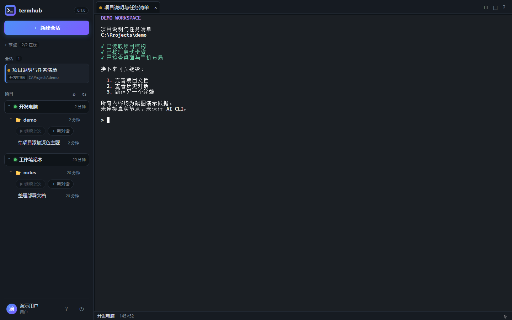
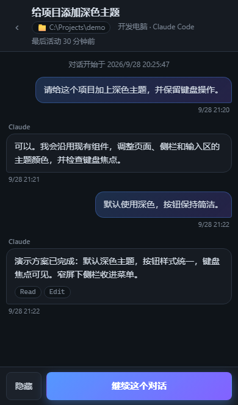

# termhub

中文 | [English](README.en.md)

**把终端里的 Codex CLI、Claude Code 和其他 CLI Agent 转到浏览器里使用，支持文件上传、下载，以及文字和图片的粘贴、终端文字的复制。**

支持电脑浏览器、手机浏览器，也支持安装为 PWA。可以查看输出、发送指令、传输文件，在同一个页面里管理多台 Windows 电脑上的会话。

termhub 转发的是原来的终端，会话仍在你的 Windows 电脑上运行。你用的还是原来的 CLI、账号和工作目录。

## 功能

- 按机器排列会话，支持标签页和分屏。
- 查看 Claude Code、Codex 的历史对话，按项目文件夹查找并继续会话。官方历史文件只读。
- 上传图片和文件，下载文件或将文件夹打包下载。
- 手机浏览器和 PWA，提供输入框及可点击的终端选项。
- 显示会话状态、上下文用量和估算费用；费用不是实际账单。
- 密码与 TOTP 登录，支持恢复码、受信任设备及操作审计。

termhub 不修改官方 CLI，也不代替它们的安装、登录或订阅。

## 界面

截图使用虚构的机器、项目和对话数据。手机截图来自浏览器模拟。





## 安装

需要一台运行 Hub 的 Linux 主机，以及至少一台作为节点的 Windows 电脑。Hub 的安装说明使用 Docker 和 Compose；Windows 节点使用 PowerShell 7。

v0.1.0 是首个发行版本。发布后可在 [Releases](https://github.com/czgreat/termhub/releases) 下载：

| 程序 | 平台 |
| --- | --- |
| Hub | Linux amd64 / arm64 |
| agent | Windows amd64 |

- **使用发布包**：按[发布包安装说明](docs/发布包安装.md)操作，无需 Go 或 Node.js。
- **从源码构建**：见[部署指南](docs/部署指南.md)，需要 Go 1.27+、Node.js 22.13+。

ARM64 包尚未在 ARM 真机验收。发布包未签名，请核对来源和同一 Release 的 SHA256SUMS.txt。

### 交给 Agent 部署

如果你使用的 Agent 能读取仓库并执行命令，可以把下面这段发给它。部署过程中，账号创建、凭据输入和官方 CLI 登录仍需你本人完成。

```text
请帮我部署 termhub。先读取 https://github.com/czgreat/termhub/blob/main/docs/AGENT-DEPLOY.md 及其引用的安装文档；若无法访问，请告诉我并等待我提供文件，不要猜测步骤。确认目标主机、Windows 用户、访问地址、安装版本，以及是首次安装还是升级；优先使用该版本的发布包，没有可用包时再说明源码构建方案。按所选版本的文档执行，在已有安装上操作前说明影响并取得确认。不要让我在聊天中提供密码或令牌，不修改官方 CLI 的配置和登录；需要我输入凭据时停下来交给我。完成后报告版本、节点状态、已验证的项目和未完成事项。
```

## 运行方式与限制

浏览器通过 HTTPS / WebSocket 连接 Hub，Windows agent 主动连接 Hub。Hub 提供网页、账号管理和会话转发；节点上的会话宿主持有终端进程。结构见[架构说明](docs/架构.md)。

- 节点目前只支持 Windows，不支持 Linux 或 macOS 节点。网页界面目前以中文为主。
- 默认在 Windows 用户登录后延迟 3 分钟启动 agent。无人登录也需在线时，按安装文档配置 `-AtStartup`；必须使用同一个具备管理员权限的安装账号。
- 升级 agent 的连接进程不会更新已运行的会话宿主。宿主更新需另行安排结束会话和重启。
- 本版使用脚本安装和升级，没有自动升级或托盘程序。
- iPhone、Android 真机的完整验收尚未完成。

## 访问权限与备份

将节点上的 CLI 配置绑定给某个用户，意味着该用户可以访问节点运行账号有权访问的文件。它不提供文件系统隔离，请只授权可信用户。

Hub 的 27443 端口应限制在局域网内；外网访问按[安全说明](docs/安全说明.md)配置 HTTPS 反向代理或隧道。备份时保留整个 `data/` 目录，包括数据库、主密钥和证书。

## 开发

网页在 `web/`，Hub 在 `internal/hub/`，节点在 `internal/agent/`。构建 Hub 前需要构建网页：

```sh
cd web
npm ci
npm run build
npm run check
npm run test:unit
cd ..
go test ./...
```

完整 Go 测试需在 Windows 上执行，包含使用假 CLI 的浏览器端到端测试。开发约定见 [AGENTS.md](AGENTS.md)。

## 许可

[MIT](LICENSE)。第三方依赖许可见 [THIRD_PARTY_LICENSES](THIRD_PARTY_LICENSES)。

## 友情链接

- [LINUX DO 社区](https://linux.do/)
